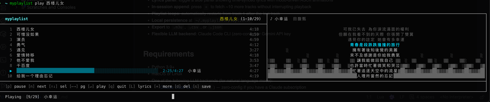

# myplaylist

[](https://pypi.org/project/myplaylist/)
[](https://pypi.org/project/myplaylist/)

Generate and play music playlists in your terminal from natural language prompts or seed songs.



## Why myplaylist?

- **AI-native, terminal-first** — describe any mood or song in plain language and get a curated playlist instantly, without leaving your terminal
- **Ad-free playback** — streams directly from YouTube via yt-dlp and mpv; no ads, no interruptions
- **You own your playlists** — add, delete, reorder, and save tracks live during playback; export to M3U/CSV/JSON for use anywhere
- **Vast music catalog** — any song on YouTube is fair game, from mainstream hits to obscure jazz recordings and everything in between
- **No account, no tracking** — everything stays local in `~/.myplaylist/`; no sign-up, no cloud sync, no data collection
- **Zero extra subscription** — works with your existing Claude subscription, or a minimal Gemini API key; no music platform membership required
- **Immersive terminal experience** — time-synced lyrics and mood-driven ASCII animations keep the vibe going while you work

## Features

- **Natural language prompts**: `myplaylist new "下雨天的 lo-fi jazz"`
- **Seed songs**: `myplaylist new --seed "Norah Jones - Come Away With Me"`
- **Terminal playback** via mpv with a rich TUI (pause / skip / lyrics marquee / progress bar)
- **Lyrics panel**: toggle a side panel showing time-synced lyrics with mood-driven ASCII animations
- **In-session append**: press `+` to fetch ~10 more tracks without interrupting playback
- **Playlist loops**: automatically restarts from track 1 after the last track
- **Local persistence** at `~/.myplaylist/playlists/`
- **Export** to `.m3u`, `.csv`, or `.json`
- **Flexible LLM backend**: Claude Code CLI (zero-config) or Gemini API key

## Requirements

- Python 3.9+
- macOS or Linux
- One of the following LLM backends (for natural language mode):
  - [Claude Code CLI](https://docs.anthropic.com/en/docs/claude-code) (`claude`) — zero-config if you have a Claude subscription
  - Gemini API key — set via `myplaylist setup`

## Installation

### macOS — Homebrew (recommended)

```bash
brew tap haoziwlh/autoplaylist https://github.com/haoziwlh/autoplaylist && brew install myplaylist
```

Homebrew handles everything: Python, mpv, and myplaylist itself.

### macOS / Linux — curl one-liner

```bash
curl -fsSL https://raw.githubusercontent.com/haoziwlh/autoplaylist/main/install.sh | bash
```

The script detects your OS, installs pipx, myplaylist, and mpv automatically.

### Manual — pipx

```bash
pipx install myplaylist
```

> mpv is required for playback. Install it separately if needed:
> - macOS: `brew install mpv`
> - Linux: `sudo apt-get install mpv`

On first run, myplaylist will automatically guide you through setup (LLM backend, optional Last.fm key).

## Quick Start

```bash
# Play your most recent playlist instantly
myplaylist

# Natural language prompt
myplaylist new "rainy day lo-fi jazz for working"

# Seed song
myplaylist new --seed "Norah Jones - Come Away With Me"

# Seed from YouTube URL
myplaylist new --seed "https://www.youtube.com/watch?v=..."

# Custom track count (default 20, max 50) and name
myplaylist new "chill beats" --count 30 --name my-chill-list
```

## Commands

| Command | Description |
|---|---|
| `myplaylist` | Play the most recent playlist |
| `myplaylist new "<prompt>"` | Generate playlist from natural language |
| `myplaylist new --seed "<song>"` | Generate playlist from seed song |
| `myplaylist new ... --count <n>` | Set track count (default 20, max 50) |
| `myplaylist list` | List all saved playlists |
| `myplaylist show <name>` | Show track listing |
| `myplaylist play [name]` | Play a playlist (defaults to most recent) |
| `myplaylist export <name> --format m3u\|csv\|json` | Export playlist |
| `myplaylist delete <name>` | Delete a playlist |
| `myplaylist setup` | Choose LLM backend and configure API keys |

## Playback Controls

| Key | Action |
|---|---|
| `p` | Pause / resume |
| `n` | Skip to next track |
| `↑ / ↓` | Move cursor up / down |
| `← / →` | Page up / page down |
| `Enter` | Jump to selected track |
| `0`–`9` + `Enter` | Jump to track by number |
| `+` | Append ~10 more tracks (background, non-blocking) |
| `r` | Cycle playback mode: sequential →→ / repeat-one ↺ / shuffle ⇄ |
| `l` | Toggle lyrics panel (time-synced lyrics + mood animation) |
| `y` | Cycle to next lyrics source (when multiple candidates available) |
| `[` / `]` | Switch to previous / next playlist |
| `d` | Delete cursor track from live playlist |
| `s` | Save current playlist to disk |
| `q` | Quit |

## Lyrics Panel

Press `l` during playback to open a side panel with time-synced lyrics. The panel also shows a mood-driven ASCII animation in the margin — determined per track by the LLM (calm, melancholic, energetic, romantic, nostalgic).

Lyrics are fetched in parallel from [lrclib.net](https://lrclib.net) (up to 3 candidates) and [Netease Cloud Music](https://music.163.com) — improving coverage for Chinese music and other tracks not found on lrclib. Press `y` to cycle through available sources; the status bar shows the current source index (e.g. `Lyrics 2/3`).

Requires terminal width ≥ 84 columns.

## Last.fm (optional)

Last.fm integration improves similar-song quality — without it, myplaylist falls back to yt-dlp search only.

**Getting a free API key:**

1. Go to <https://www.last.fm/api/account/create> (create a Last.fm account first if needed)
2. Fill in any values for Application name / description (e.g. `myplaylist` / `personal use`)
3. Leave Callback URL blank, submit
4. Copy the **API key** and **Shared secret** from the confirmation page

**Saving the key:**

```bash
myplaylist config --lastfm-key <API key> --lastfm-secret <shared secret>
```

Or re-run setup and enter them interactively:

```bash
myplaylist setup
```

## Troubleshooting

**Playback stuck on "Loading" / tracks all skipped**

YouTube occasionally requires authentication for certain IPs. myplaylist automatically tries to use cookies from your browser (Chrome, Firefox, Edge, or Brave) to work around this. If you still have issues:

1. Run with `--debug` to see what's happening:
   ```bash
   myplaylist play --debug
   cat ~/.myplaylist/player.log
   ```
2. If the log shows `Sign in to confirm you're not a bot`, export a `cookies.txt` file from your browser using an extension such as [Get cookies.txt LOCALLY](https://chromewebstore.google.com/detail/get-cookiestxt-locally/cclelndahbckbenkjhflpdbgdldlbecc) (Chrome) or [cookies.txt](https://addons.mozilla.org/firefox/addon/cookies-txt/) (Firefox), then:
   ```bash
   myplaylist config --cookie-file ~/cookies.txt
   ```

**`myplaylist` command not found after install**

Open a new terminal, or run:
```bash
source ~/.zshrc   # macOS / zsh
source ~/.bashrc  # Linux / bash
```

## Data Storage

```
~/.myplaylist/
  config.json          # API keys and settings
  playlists/
    <name>.json        # Saved playlists
```

## Upgrade

```bash
# pipx
pipx upgrade myplaylist

# Homebrew
brew upgrade myplaylist
```

## Uninstall

```bash
# If installed via pipx or the install.sh script:
pipx uninstall myplaylist

# If installed via Homebrew tap:
brew uninstall myplaylist
brew untap haoziwlh/autoplaylist
```

## License

MIT — see [LICENSE](LICENSE).

## Running Tests

```bash
pip install pytest
pytest tests/                     # smoke tests (no network)
pytest tests/ -m slow             # include integration tests (requires network)
```
